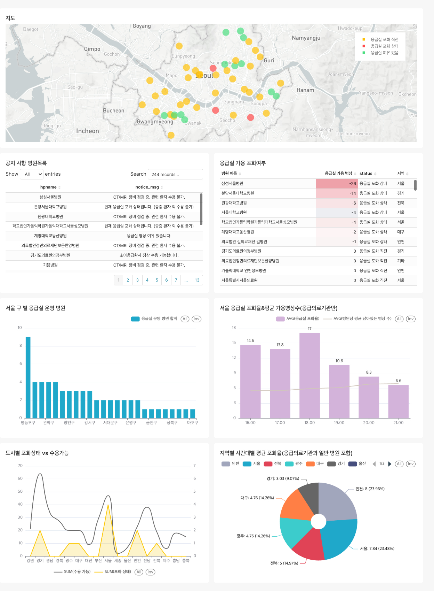

# 🚑 응급실 실시간 병상 현황 데이터 파이프라인

> **공공데이터 API → Kafka → Spark → PostgreSQL → Superset** 실시간 응급실 병상 현황을 수집하고 대시보드로 시각화하는 End-to-End 데이터 파이프라인

---

## 💡 기획 배경

응급실 포화라는 안타까운 현실 속에서도, 소방(119)과 병원은 환자를 살리기 위해 끊임없이 수용 여부를 확인하고 실시간으로 병상 데이터를 주고받으며 사투를 벌이고 있습니다. 병원 근무와 대학교 소방 실습 시절, 구급대원이 상황실과 연락을 취하면 즉각적으로 수용 가능한 병원을 파악해 내는 이 연계 시스템을 현장에서 직접 경험했습니다.

> **"전국 수백 개 병원의 실시간 병상 현황과 수용 가능 여부가, 어떻게 지연 없이 119 지령센터와 구급차 패드로 공유될 수 있을까?"**

과거에는 그저 신기하게만 바라보았던 이 시스템이, 거대한 실시간 데이터 파이프라인의 결과물이라는 것을 깨달았습니다. 현장에서 생명을 살리는 데 기여하는 이 거대한 데이터의 흐름을 기술적으로 직접 이해하고 **역설계(Reverse Engineering)** 해보고자 본 프로젝트를 기획했습니다.

**🎯 목표:** 실시간 API 데이터를 수집해 메시지 큐로 버퍼링하고, 분산 처리 엔진으로 가공하여 데이터베이스에 적재한 뒤 대시보드로 시각화하는 End-to-End 파이프라인 구축

---

## 🏗 아키텍처

```
공공데이터 API (5분 주기)
    ↓
  Producer (Python)
    ↓
  Kafka (er-realtime 토픽)
    ↓
  Spark Streaming Consumer
    ↓
  PostgreSQL
    ├── er_realtime      실시간 병상 — Spark 적재
    ├── er_hospitals     병원 기본정보 — Airflow 1일 1회
    └── er_hourly_stats  시간대별 집계 — Airflow 1시간 주기
    ↓
  Superset 대시보드
```

---

## 🛠 기술 스택

|역할|기술|
|---|---|
|메시지 큐|Kafka 3.7 (KRaft)|
|스트리밍 처리|Spark 3.5 + PySpark|
|배치 파이프라인|Airflow 2.9|
|데이터베이스|PostgreSQL 16|
|시각화|Apache Superset 3.1|
|컨테이너|Docker Compose|

---

## 🔌 포트 구성

|서비스|포트|설명|
|---|---|---|
|PostgreSQL|`5434`|DB 접속 (DataGrip 등)|
|Kafka|`9093`|외부 접속용|
|Spark Web UI|`8083`|작업 모니터링|
|Airflow UI|`8084`|DAG 관리|
|Superset|`8089`|대시보드|

---

## 🚀 빠른 시작

> **시스템 권장 사양:** RAM 8GB 이상

### 1. 환경 변수 설정

```env
HOSPITAL_API_KEY=발급받은_API_키
SUPERSET_SECRET_KEY=랜덤_시크릿_키
MAPBOX_API_KEY=Mapbox_API_키
POSTGRES_DB=hospital_db
POSTGRES_USER=hospital_user
POSTGRES_PASSWORD=hospital_password
```

### 2. 컨테이너 실행

```bash
docker compose up -d
docker compose ps
```

### 3. 데이터 수집 시작

```bash
# Producer 실행
docker exec -it hospital-spark-master \
    /opt/spark/bin/spark-submit \
    --master spark://spark-master:7077 \
    /opt/spark/apps/producer.py

# Consumer 실행
docker exec -it hospital-spark-master \
    /opt/spark/bin/spark-submit \
    --master spark://spark-master:7077 \
    --executor-memory 1g \
    --driver-memory 1g \
    --jars /opt/spark/jars/spark-sql-kafka-0-10_2.12-3.5.0.jar,\
/opt/spark/jars/spark-token-provider-kafka-0-10_2.12-3.5.0.jar,\
/opt/spark/jars/kafka-clients-3.4.1.jar,\
/opt/spark/jars/commons-pool2-2.11.1.jar,\
/opt/spark/jars/postgresql-42.7.1.jar \
    /opt/spark/apps/consumer.py
```

### 4. Airflow DAG 및 대시보드 확인

- **Airflow:** `http://localhost:8084` (admin / admin)
    - `hospital_info_dag` → `er_hourly_stats_dag` 순서로 실행
- **Superset:** `http://localhost:8089` (admin / admin)
    - 응급실 실시간 병상 현황 대시보드 확인

---

## 📂 폴더 구조

```
hospital-project/
├── airflow/
│   └── dags/
│       ├── __pycache__/
│       │   ├── er_hospitals_dag.cpython-312.pyc (5.4 KB)
│       │   ├── er_hourly_stats_dag.cpython-312.pyc (2.7 KB)
│       │   ├── er_hourly_status_dag.cpython-312.pyc (2.9 KB)
│       │   └── hospital_info_dag.cpython-312.pyc (6.7 KB)
│       ├── er_hourly_status_dag.py (2.4 KB) # 시간대별 집계 1시간 주기
│       └── hospital_info_dag.py (4.8 KB) # 병원 기본정보 1일 1회
├── docs/
│   ├── hospital-final.jpg (734.4 KB)
│   └── README.md (9.8 KB)
├── postgres/
│   └── init.sql (1.4 KB)
├── producer/
│   ├── producer.py (8.1 KB)  # API 수집 → Kafka 발행 (5분 주기)
│   ├── requirements.txt (0.1 KB)
│   └── test.py (1.0 KB)
├── spark/
│   ├── consumer.py (3.9 KB) # Kafka → PostgreSQL 적재
│   └── requirements.txt (0.0 KB)
├── spark_drivers/
│   ├── commons-pool2-2.11.1.jar (142.1 KB)
│   ├── kafka-clients-3.4.1.jar (4932.1 KB)
│   ├── postgresql-42.7.1.jar (1058.8 KB)
│   ├── spark-sql-kafka-0-10_2.12-3.5.0.jar (422.2 KB)
│   └── spark-token-provider-kafka-0-10_2.12-3.5.0.jar (55.5 KB)
├── superset/
│   └── superset_config.py (0.7 KB)  # Mapbox 설정
└── docker-compose.yml (5.2 KB)
```

---

## 📊 데이터 모델링

### 수집 API

|API|수집 항목|주기|
|---|---|---|
|`getEmrrmRltmUsefulSckbdInfoInqire`|실시간 가용병상|5분|
|`getEmrrmSrsillDissMsgInqire`|응급실 공지 메시지|1시간 캐싱|
|`getEgytBassInfoInqire`|병원 기본정보 / 위도·경도|1일|

### 핵심 테이블

**`er_realtime`** — 실시간 병상

|컬럼|타입|설명|
|---|---|---|
|hpid|VARCHAR|병원 고유 ID|
|hpname|VARCHAR|병원명|
|hvec|INTEGER|응급실 가용병상 (음수=포화)|
|hvctayn|VARCHAR|CT 가용 Y/N|
|hvventiayn|VARCHAR|인공호흡기 가용 Y/N|
|notice_msg|TEXT|공지 메시지|
|duty_tel|VARCHAR|전화번호|
|region|VARCHAR|지역 (duty_tel 지역번호 추정)|
|created_at|TIMESTAMP|수집 시각 (KST)|

**`er_hospitals`** — 병원 기본정보

|컬럼|타입|설명|
|---|---|---|
|hpid|VARCHAR|병원 고유 ID (PK)|
|hpname|VARCHAR|병원명|
|duty_addr|VARCHAR|주소|
|duty_eryn|VARCHAR|응급실 운영 여부 (1=운영)|
|wgs84_lat / wgs84_lon|FLOAT|위도 / 경도|
|region|VARCHAR|지역|
|updated_at|TIMESTAMP|갱신 시각|

**`er_hourly_stats`** — 시간대별 집계

|컬럼|타입|설명|
|---|---|---|
|stat_hour|TIMESTAMP|집계 기준 시각|
|region|VARCHAR|지역 (서울)|
|avg_beds|NUMERIC|평균 가용병상 수|
|zero_count|INTEGER|포화 병원 수 (hvec<=0)|
|saturation_pct|NUMERIC|포화율 (%)|

---

## 📈 대시보드 시각화 결과




### 도메인 지식을 반영한 hvec 상태 분류 기준

- 🟢 **`hvec > 10`** : 응급실 여유 있음
- 🟡 **`0 <= hvec < 10`** : 응급실 포화 직전
- 🔴 **`hvec < 0`** : 응급실 포화 상태

> **💡 현장 경험 코멘트:** 병원 근무 경험을 바탕으로 직접 설정한 기준입니다. 응급실에서 근무하다 보면 병상이 10개 미만으로 줄어드는 순간, 중증 환자가 한 명만 와도 바로 포화 상태로 전환되는 경우가 많습니다. 단순히 `hvec = 0`을 기준으로 삼는 것보다 10 미만부터 "포화 직전"으로 분류하는 것이 실제 현장에 훨씬 더 가까운 지표라고 판단했습니다.

### 주요 인사이트

- **가장 위험한 시간대:** 18시 포화율 최고 / 평균 가용병상수 최저 (16~17시부터 상승 → 19시 이후 감소)
- **가장 위험한 지역:** 서울 23.48% / 인천 23.96% (병원 수 대비 포화율 높음)
- **가장 위험한 병원:** 삼성서울병원 `hvec = -26` / 분당서울대학교병원 `hvec = -14`
- **서울 구별:** 영등포구 응급의료기관 9개 1위 (강남구는 일반 병원 밀집 / 응급의료기관은 적음)

---

## 🔥 트러블슈팅 & 문제 해결

단순히 정상 경로(Happy Path)로 파이프라인을 구축하는 것에 그치지 않고, 실제 데이터를 다루며 발생한 시스템적 문제와 데이터 품질 한계를 주도적으로 해결했습니다.

### [Issue 1] 공공데이터 API 지역 편향성 극복 — 데이터 역엔지니어링

- **Situation:** `er_hospitals` API가 파라미터 설정과 무관하게 서울 데이터만 반환하는 공공데이터 자체의 한계가 존재했습니다.
- **Task:** 전국 단위 병상 대시보드 구축을 위해 서울 외 지역 병원의 region 정보 맵핑이 필요했습니다.
- **Action:** `er_realtime` 에 포함된 `duty_tel` (병원 전화번호) 에 주목했습니다. Spark 스트리밍 처리 과정에서 지역번호(02, 031, 051 등)를 파싱하여 전국 `region` 컬럼을 동적으로 추정하는 로직을 추가했습니다.
- **Result:** 외부 시스템 의존도를 높이지 않고 기존 데이터 속성만 활용해 한계를 우회했으며, 전국 단위 지역별 포화율 비교 차트를 성공적으로 구현했습니다.

### [Issue 2] 도메인 지식을 활용한 지표 신뢰도 향상 & 더티 데이터 정제

- **Situation:** 강남구 응급실 수 181개 비현실적 집계, 서울 데이터에 경기도 병원 혼입 등 데이터 노이즈가 심했습니다.
- **Task:** 대시보드 실효성을 높이기 위한 데이터 정제와 실제 응급 현장 기준의 시각화 분류 재정립이 필요했습니다.
- **Action:**
    1. **데이터 정제:** `duty_eryn='1'` 필터로 일반 병원 제외, `NOT ILIKE '경기도%'` 로 행정구역 오차 교정
    2. **지표 재정의:** 병원 근무 및 소방 실습 경험을 살려 `hvec < 10` 을 포화 직전 임계점으로 정의
- **Result:** 정확한 응급의료기관 통계를 확보하고, 구급대원과 현장 의료진 관점에서 실효성 있는 모니터링 환경을 완성했습니다.

### [Issue 3] Spark Streaming OOM 및 Worker Lost 해결

- **Situation:** 5분 주기 스트리밍 적재 중 메모리 부족으로 Worker와 Master 간 Heartbeat가 끊기며 파이프라인이 중단됐습니다.
- **Task:** 데이터 유실 방지와 24시간 무중단 스트리밍 구동을 위한 리소스 최적화가 필요했습니다.
- **Action:** Spark Web UI로 메모리 사용 추이를 모니터링하여 병목을 확인했습니다. `docker-compose.yml` 에서 `SPARK_WORKER_MEMORY` 를 증설하고 `spark-submit` 에 `--executor-memory 1g` / `--driver-memory 1g` 를 명시했습니다.
- **Result:** OOM 현상을 해결하여 파이프라인 중단 이슈를 제거하고 안정적인 분산 처리 환경을 확보했습니다.

---

## 🔑 API 키 발급

- **공공데이터 API:** [data.go.kr](https://www.data.go.kr/) → 응급의료기관 정보 조회 서비스
- **Mapbox:** [account.mapbox.com](https://account.mapbox.com/) → Access tokens